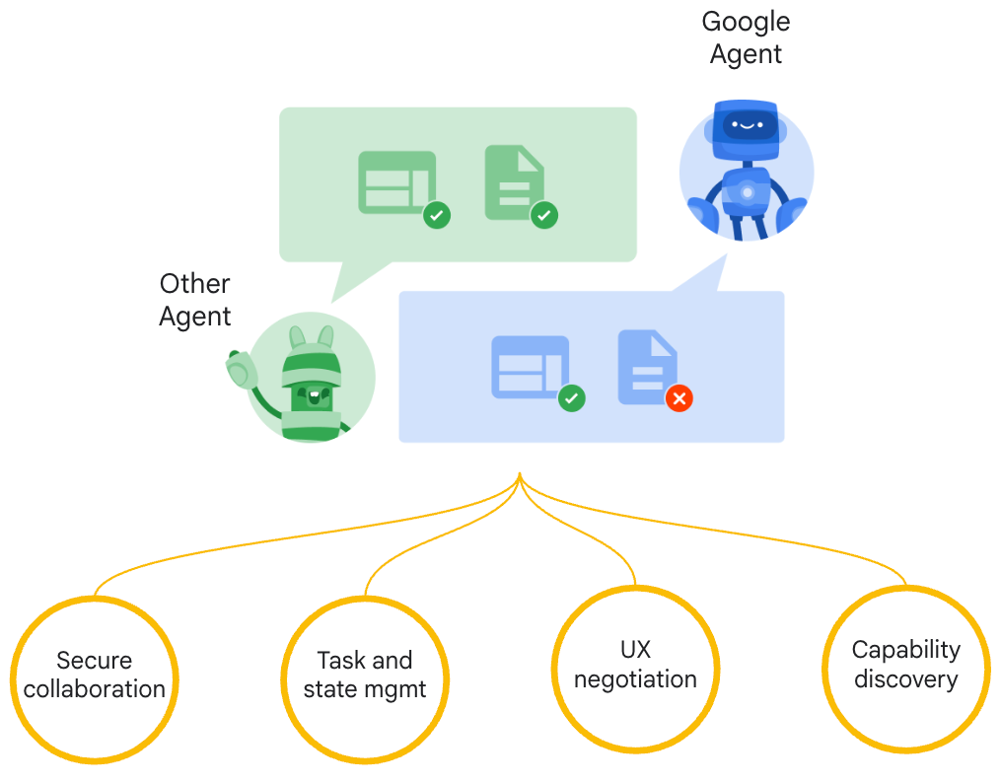

# Agent2Agent Protocol (A2A)

An open protocol enabling Agent-to-Agent interoperability, bridging the gap between **opaque** agentic systems.

## Feedback and Changes

A2A is a work in progress and is expected to change based on community feedback. This repo contains the initial specification, documentation, and [sample code](https://github.com/google/A2A/tree/main/samples). We will continue to update this repo with more features, more examples, specs, and libraries as they become available. When the spec and samples can graduate to a production quality SDK, we will declare version 1.0 and maintain stable releases.

## Key Principles

Using A2A, agents accomplish tasks for end-users without sharing memory, thoughts, or tools. Instead the agents exchange context, status, instructions, and data in their native modalities.

- **Simple**: Reuse existing standards
- **Secure**: Enterprise-grade authentication and authorization
- **Interoperable**: Interaction in natural modalities
- **Extensible**: Support for diverse runtimes and languages

## Unlock Collaborative, agent to agent scenarios with a new open protocol

* **Seamless Agent Collaboration**: Introduces a standard protocol for autonomous, opaque agents built on different frameworks and by various vendors to communicate and collaborate effectively with each other and with users, addressing the current lack of agent interoperability.
* **Simplifies Enterprise Agent Integration**: Provides a straightforward way to integrate intelligent agents into existing enterprise applications, allowing businesses to leverage agent capabilities across their technology landscape.
* **Supports Key Enterprise Requirements**: Offers core functionalities essential for secure, enterprise-grade agent ecosystems, including capability discovery, user experience negotiation, task and state management, and secure collaboration.

## Open standards for connecting Agents

* **MCP (Model Context Protocol)** for tools and resources
  * Connect agents to tools, APIs, and resources with structured inputs/outputs.
  * Google ADK supports MCP tools. Enabling wide range of MCP servers to be used with agents.
* **A2A (Agent2Agent Protocol)** for agent-agent collaboration
  * Dynamic, multimodal communication between different agents without sharing memory, resources, and tools
  * Open standard driven by community.
  * Samples available using Google ADK, LangGraph, Crew.AI

To understand A2A design principles and external partners supporting A2A, [public blog post](https://developers.googleblog.com/en/a2a-a-new-era-of-agent-interoperability/)

Interested to contribute and know more about the internals of A2A protocol ? [Github](https://github.com/google/A2A) 

   
