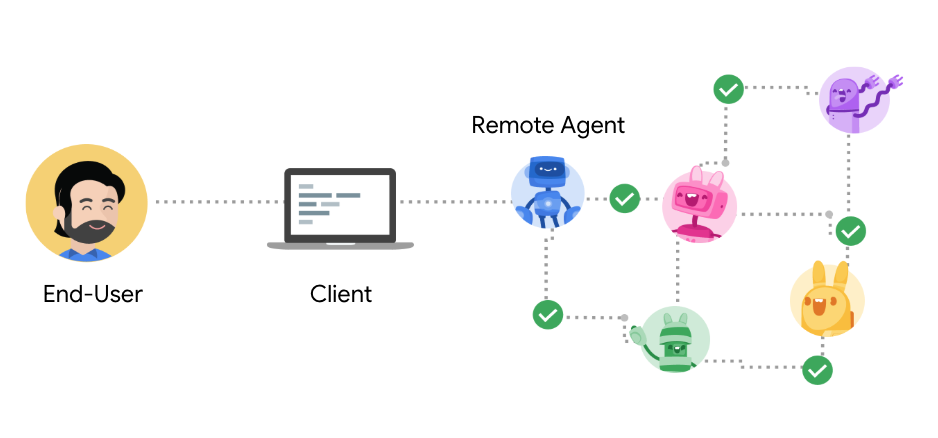

# Agent2Agent 協議 (A2A)

一種開放協議，實現Agent-to-Agent互操作性，連接**不透明**的智能體系統。

## 反饋和變更

A2A 是一個正在進行中的工作，預計會根據社區反饋進行變更。此存儲庫包含初始規範、文檔和[示例代碼](https://github.com/google/A2A/tree/main/samples)。我們將繼續用更多功能、示例、規範和庫更新此存儲庫。當規範和示例可以升級為生產質量SDK時，我們將聲明版本1.0並維護穩定版本。

## 核心原則

使用A2A，智能體無需共享記憶、思想或工具即可完成用戶任務。相反，智能體以其原生模態交換上下文、狀態、指令和數據。

- **簡單**：重用現有標準
- **安全**：企業級身份驗證和授權
- **互操作**：自然模態的交互
- **可擴展**：支持多種運行時和語言

 

## 解鎖協作式智能體交互場景，構建全新開放協議

* **無縫智能體協作**：為不同框架和供應商構建的自主、不透明智能體引入標準協議，使其能夠與彼此和用戶高效溝通和協作，解決當前智能體互操作性缺失的問題。
* **簡化企業智能體集成**：提供一種直接的方式將智能體集成到現有企業應用中，使企業能夠在技術生態中利用智能體能力。
* **支持關鍵企業需求**：提供安全、企業級智能體生態系統所需的核心功能，包括能力發現、用戶體驗協商、任務和狀態管理以及安全協作。

## 連接智能體的開放標準

* **MCP (模型上下文協議)** 用於工具和資源
  * 將智能體連接到具有結構化輸入/輸出的工具、API和資源。
  * Google ADK支持MCP工具，使大量MCP服務器能夠與智能體一起使用。
* **A2A (Agent2Agent 協議)** 用於智能體間協作
  * 不同智能體之間的動態、多模態通信，無需共享記憶、資源和工具
  * 由社區驅動的開放標準
  * 使用Google ADK、LangGraph、Crew.AI的示例可用

了解A2A設計原則和支持A2A的外部合作夥伴，請參閱[公開博客文章](https://developers.googleblog.com/en/a2a-a-new-era-of-agent-interoperability/)

有興趣貢獻並了解更多A2A協議內部機制？請訪問[Github](https://github.com/google/A2A)

   
